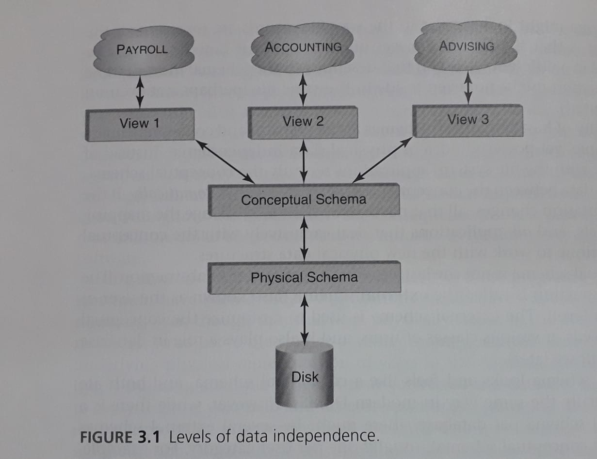

# Note:  

**Contents of this file have been taken from chapter 3 of the book Database Systems: An application oriented approach 2nd Edition by Michael Kifer, Arthur Bernstein, and Philip M. Lewis.**

# The Relational Data Model

Ultimately all data is recorded as bytes on a disk. However working with data at this low level of abstraction is quite tedious. Few people are interested in how sectors, tracks, and cylinders are allocated for storing information. Most programmers prefer to work with data stored in **files**, which is a more reasonable abtraction for many applications.

A variety of methods exist for storing data in files. **Sequential files** are best for applications that access records in the order in which they were stored. **Direct Access** or random access files are best when records are accessed in a more or less unpredictable order.
Files might have indices, which are auxilary data structuresthat enable applications to retrieve records based on the value of a search key.

The details of how data is stored in files belong to the **physical level** of data modeling. This level is specified using a **physical schema**, which refers to the syntax that describe the structure of files and indices.

Early data-intensive applications worked directly with the physical schema. This choice was made for a numer of reasons: 
 
 1. Commercial database systems were rare and costly.
 2. Computers were slow and working directly with the file system offered a performance advantage.

A serious drawback of this approach is that changes to the file format at the physical level could hae costly repercussions for the software maintenance. The year 2000 problem was a good example of such repercussions. (The solution to the Y2K problem is data abstraction, a Date data type). 

The **conceptual model** hides the details of the physical data representation and instead describes data in terms of higher-level concepts that are closer to the way humans view it. 

For instance the conceptual schema could represent some of the information about students as 

STUDENT (Id: INT, Name: STRING, Address: STRING, Status: STRING)

While this schema might look similar to the way file records are represented, the important point is that the different pieces of information it describes might be physically stored in a different way than that described in the schema. Indeed, these pieces of information might not even reside in the same file(perhaps not even on the same computer).

The possibility of having separate schemas at the physical and conceptual levels leads to the simple yet powerful idea of physical data independence. 

Instead of working directly with the file system, applications see only the conceptual schema. The DBMS maps data between the conceptual and physical levels automatically. 

If the physical representation changes, all that needs to be done is to change the mapping between the levels, and all applications that deal exclusively with the conceptual schema will continue to work with the new physical data structures.

The third level of abstraction is called the **external schema**(also known as he user or view abstraction level). The external schema is used to customize the conceptual schema to the needs of various classes of users, and it also plays a role in database security.

The external schema looks and feels like a conceptual schema, and both are defined in essentially the same way in modern DBMSs. However, while there is a single conceptual schema per databse, there might be several external schemas, usually one per user category.

Conceptual data independence: Applications tailored to the needs of specific user groups can be designed to use the external schemas appropriate for these groups. The mapping between the external and conceptual schemas is the responsibility of the DBMS, so applications are insulated from changes in the conceptual schema as well as from changes in the physical schema. 

