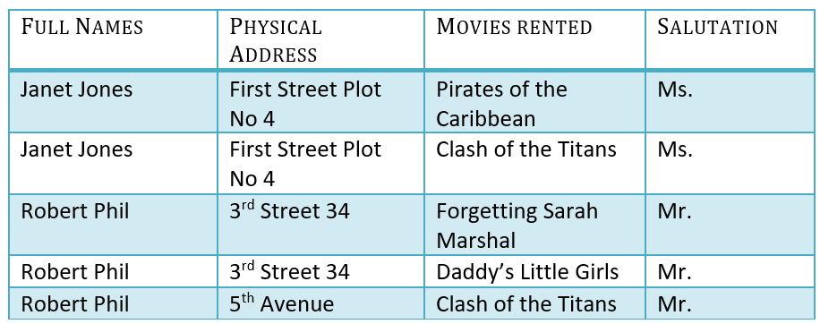

**Credit: Following contents have been taken from [this online tutorial](https://www.guru99.com/database-normalization.html)**

# What is Normalization? 1NF, 2NF, 3NF, BCNF Database Example

## What is Normalization?
**NORMALIZATION** is a database design technique that reduces data redundancy and eliminates undesirable characteristics like Insertion, Update and Deletion Anomalies. Normalization rules divides larger tables into smaller tables and links them using relationships. The purpose of Normalization in SQL is to eliminate redundant (repetitive) data and ensure data is stored logically.

The inventor of the relational model **Edgar Codd** proposed the theory of normalization with the introduction of the First Normal Form, and he continued to extend theory with Second and Third Normal Form. Later he joined **Raymond F. Boyce** to develop the theory of **Boyce-Codd Normal Form**.

## Database Normal Forms
Here is a list of Normal Forms

- 1NF (First Normal Form)
- 2NF (Second Normal Form)
- 3NF (Third Normal Form)
- BCNF (Boyce-Codd Normal Form)
- 4NF (Fourth Normal Form)
- 5NF (Fifth Normal Form)
- 6NF (Sixth Normal Form)

The Theory of Data Normalization in SQL is still being developed further. For example, there are discussions even on 6th Normal Form. However, in most practical applications, normalization achieves its best in 3rd Normal Form. The evolution of Normalization theories is illustrated below-

## Database Normalization With Examples
Database Normalization Example can be easily understood with the help of a case study. Assume, a video library maintains a database of movies rented out. Without any normalization, all information is stored in one table as shown below.

Here you see Movies Rented column has multiple values. Now let's move into 1st Normal Forms:

## 1NF (First Normal Form) Rules
- Each table cell should contain a single value.
- Each record needs to be unique.

Before we proceed let's understand a few things 

## What is a KEY?

A KEY is a value used to identify a record in a table uniquely. A KEY could be a single column or combination of multiple columns

Note: Columns in a table that are NOT used to identify a record uniquely are called non-key columns.

## What is a Primary Key?
A primary is a single column value used to identify a database record uniquely.
It has following attributes: 

-  A primary key cannot be NULL
-  A primary key value must be unique
-  The primary key values should rarely be changed
-  The primary key must be given a value when a new record is inserted.

## What is Composite Key?
A composite key is a primary key composed of multiple columns used to identify a record uniquely

In our database, we have two people with the same name Robert Phil, but they live in different places.

Hence, we require both Full Name and Address to identify a record uniquely. That is a composite key.

Let's move into second normal form 2NF

## 2NF (Second Normal Form) Rules
- Rule 1- Be in 1NF
- Rule 2- Single Column Primary Key

It is clear that we can't move forward to make our simple database in 2nd Normalization form unless we partition the table above.

We have divided our 1NF table into two tables viz. Table 1 and Table2. Table 1 contains member information. Table 2 contains information on movies rented.

We have introduced a new column called **Membership_id** which is the primary key for table 1. Records can be uniquely identified in Table 1 using membership id

## Database - Foreign Key
In Table 2, **Membership_ID** is the Foreign Key

**Foreign Key** references the primary key of another Table! It helps connect your Tables

- A foreign key can have a different name from its primary key
- It ensures rows in one table have corresponding rows in another
- Unlike the Primary key, they do not have to be unique. Most often they aren't
- Foreign keys can be null even though primary keys can not 

## Why do you need a foreign key?
Suppose, a novice inserts a record in Table B such as

You will only be able to insert values into your foreign key that exist in the unique key in the parent table. This helps in referential integrity. 

The above problem can be overcome by declaring membership id  from **Table2**  as foreign key of membership id from **Table1**

Now, if somebody tries to insert a value in the membership id field that does not exist in the parent table, an error will be shown!

## What are transitive functional dependencies?
A transitive functional dependency is when changing a non-key column, might cause any of the other non-key columns to change

Consider the table 1. Changing the non-key column Full Name may change Salutation.

Let's move into 3NF

## 3NF (Third Normal Form) Rules
- Rule 1- Be in 2NF
- Rule 2- Has no transitive functional dependencies

To move our 2NF table into 3NF, we again need to divide our table.

### 3NF Example

We have again divided our tables and created a new table which stores Salutations. 

There are no transitive functional dependencies, and hence our table is in 3NF

In Table 3 Salutation ID is primary key, and in Table 1 Salutation ID is foreign to primary key in Table 3

Now our little example is at a level that cannot further be decomposed to attain higher normal forms of normalization. In fact, it is already in higher normalization forms. Separate efforts for moving into next levels of normalizing data are normally needed in complex databases.  However, we will be discussing next levels of normalizations in brief in the following.

## BCNF (Boyce-Codd Normal Form)
Even when a database is in 3rd Normal Form, still there would be anomalies resulted if it has more than one Candidate Key.

Sometimes BCNF is also referred as **3.5 Normal Form**.

## 4NF (Fourth Normal Form) Rules
If no database table instance contains two or more, independent and multivalued data describing the relevant entity, then it is in 4th Normal Form.

## 5NF (Fifth Normal Form) Rules
A table is in 5th Normal Form only if it is in 4NF and it cannot be decomposed into any number of smaller tables without loss of data.

## 6NF (Sixth Normal Form) Proposed
6th Normal Form is not standardized, yet however, it is being discussed by database experts for some time. Hopefully, we would have a clear & standardized definition for 6th Normal Form in the near future...

That's all to SQL Normalization!!!

## Summary
- Database designing is critical to the successful implementation of a database management system that meets the data requirements of an enterprise system.
- Normalization in DBMS helps produce database systems that are cost-effective and have better security models.
- Functional dependencies are a very important component of the normalize data process
- Most database systems are normalized database up to the third normal forms.
- A primary key uniquely identifies are record in a Table and cannot be null
- A foreign key helps connect table and references a primary key
