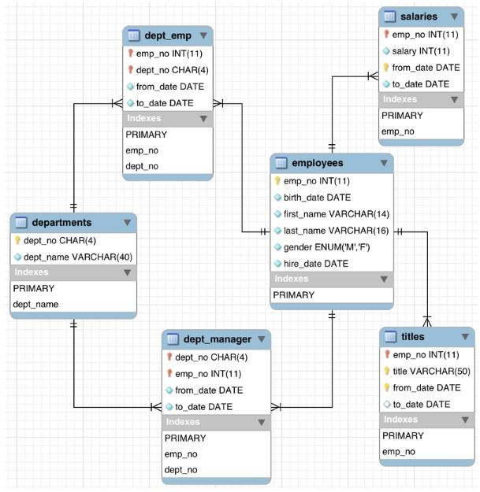

# A Nice Exercise for beginners 

## ERD


## Questions
##### 1. Write an SQL statement to list all employees who are working in the Sales department for which the hire date is between 1995 - 2008
##### 2. Write an SQL statement to show all titles of employees who are getting more than £20000 salary and for which the hire date was after 1985
##### 3. Write an SQL statement to show the full names, salaries and gender of those in the HR department.
##### 4. Write an SQL statement to show all employees’ names, department names and their departments’ managers.
##### 5. Write an SQL statement to show a list of employees who were hired between 1980 and 1995 and whose first name starts with A or S
##### 6. Write an SQL statement to change the employee’s title who works in the finance department and whose first name starts with ‘S’. 
##### 7. Write an SQL statement to increase the salaries of all employees up to 10 % for those who have been working since 1997 and work in the Marketing department.
##### 8. Write an SQL statement to delete employees’ record in the sales department and whose last name starts with A or S
##### 9. Create a database view to list the full names of all employees, salaries, their departments, and departments manager
##### 10. Create a database view to list all employees, departments and their departments’ managers of those who were hired between 1990 and 2000.

# SQL to create the database

### Copy and Paste this script to the SQL editor or create and .sql file and paste it there and then just import it to the editor of you choice.
#### You can read this sample data generating SQL script to understand how to create tables and keys (primary and foreign) and insert data into created tables.

```sql
DROP DATABASE IF EXISTS employees; 

CREATE DATABASE IF NOT EXISTS employees;

USE employees;

SELECT 'CREATING DATABASE STRUCTURE' as 'INFO';

DROP TABLE IF EXISTS dept_emp, dept_manager,titles,salaries, employees, departments;

CREATE TABLE employees ( 
	emp_no 		INT NOT NULL, 
	birth_date 	DATE NOT NULL,
	first_name 	VARCHAR(14) NOT NULL, 
	last_name 	VARCHAR(16) NOT NULL, 
	gender 		ENUM ('M','F') NOT NULL,
	hire_date 	DATE NOT NULL, 
	PRIMARY KEY (emp_no)
);

CREATE TABLE departments( 
	dept_no 	CHAR(4) NOT NULL, 
	dept_name 	VARCHAR(40) NOT NULL, 
	PRIMARY KEY (dept_no),
	UNIQUE KEY (dept_name)
);

CREATE TABLE dept_manager ( 
	emp_no 		INT NOT NULL, 
	dept_no 	CHAR(4) NOT NULL, 
	from_date 	DATE NOT NULL,
 	to_date 	DATE NOT NULL,
	FOREIGN KEY (emp_no) REFERENCES employees (emp_no) ON DELETE CASCADE, 
	FOREIGN KEY (dept_no) REFERENCES departments (dept_no) ON DELETE CASCADE, 
	PRIMARY KEY (emp_no,dept_no)
);

CREATE TABLE dept_emp ( 
	emp_no 		INT NOT NULL, 
	dept_no 	CHAR(4) NOT NULL, 
	from_date 	DATE NOT NULL, 
	to_date 	DATE NOT NULL,
	FOREIGN KEY (emp_no) REFERENCES employees (emp_no) ON DELETE CASCADE, 
	FOREIGN KEY (dept_no) REFERENCES departments (dept_no) ON DELETE CASCADE, 
	PRIMARY KEY (emp_no,dept_no)
);

CREATE TABLE titles ( 
	emp_no 		INT NOT NULL,
	title 		VARCHAR(50) NOT NULL,
	from_date 	DATE NOT NULL, 
	to_date 	DATE,
	FOREIGN KEY (emp_no) REFERENCES employees (emp_no) ON DELETE CASCADE, 
	PRIMARY KEY (emp_no,title, from_date)
);

CREATE TABLE salaries ( 
	emp_no 		INT NOT NULL, 
	salary 		INT NOT NULL, 
	from_date 	DATE NOT NULL, 
	to_date 	DATE NOT NULL,
	FOREIGN KEY (emp_no) REFERENCES employees (emp_no) ON DELETE CASCADE, 
	PRIMARY KEY (emp_no, from_date)
) ;


INSERT INTO `departments` VALUES ('d001','Marketing'),('d002','Finance'),
				('d003','Human Resources'), ('d004','Production'),
				('d005','Development'),('d006','Quality Management'),
				('d007','Sales'),('d008','Research'),('d009','Customer Service');

INSERT INTO `employees` VALUES (10001,'1953-09-02','Georgi','Facello','M','1986-06-26'), 
				(10002,'1964-06-02','Bezalel','Simmel','F','1985-11-21'),
				(10003,'1959-12-03','Parto','Bamford','M','1986-08-28'),
				(10004,'1954-05-01','Chirstian','Koblick','M','1986-12-01'),
				(10005,'1955-01-21','Kyoichi','Maliniak','M','1989-09-12'),
				(10006,'1953-04-20','Anneke','Preusig','F','1989-06-02'),
				(10007,'1957-05-23','Tzvetan','Zielinski','F','1989-02-10'),
				(10008,'1958-02-19','Saniya','Kalloufi','M','1994-09-15'),
				(10009,'1952-04-19','Sumant','Peac','F','1985-02-18'),
				(10010,'1963-06-01','Duangkaew','Piveteau','F','1989-08-24'),
				(10011,'1953-11-07','Mary','Sluis','F','1990-01-22'),
				(10012,'1960-10-04','Patricio','Bridgland','M','1992-12-18'),
				(10013,'1963-06-07','Eberhardt','Terkki','M','1985-10-20'),
				(10014,'1956-02-12','Berni','Genin','M','1987-03-11');

INSERT INTO `dept_emp` VALUES 	(10001,'d005','1986-06-26','9999-01-01'),
				(10002,'d007','1996-08-03','9999-01-01'),
				(10003,'d004','1995-12-03','9999-01-01'),
				(10004,'d004','1986-12-01','9999-01-01'),
				(10005,'d003','1989-09-12','9999-01-01'),
				(10006,'d005','1990-08-05','9999-01-01'),
				(10014,'d005','1993-12-29','9999-01-01');
 
INSERT INTO `dept_manager` VALUES (10013,'d001','1985-01-01','1991-10-01'), 
				(10001,'d001','1991-10-01','9999-01-01'),
				(10002,'d002','1985-01-01','1989-12-17'),
				(10008,'d002','1989-12-17','9999-01-01'),
				(10012,'d003','1985-01-01','1992-03-21'),
				(10011,'d003','1992-03-21','9999-01-01'),
				(10014,'d004','1985-01-01','1988-09-09'),
				(10003,'d004','1988-09-09','1992-08-02');

INSERT INTO `salaries` VALUES (10001,60117,'1986-06-26','1987-06-26'), 
				(10001,62102,'1987-06-26','1988-06-25'),
				(10002,66074,'1988-06-25','1989-06-25'),
				(10003,66596,'1989-06-25','1990-06-25'),
				(10004,66961,'1990-06-25','1991-06-25'),
				(10005,71046,'1991-06-25','1992-06-24'),
				(10006,74333,'1992-06-24','1993-06-24'),
				(10007,75286,'1993-06-24','1994-06-24'),
				(10008,75994,'1994-06-24','1995-06-24');

INSERT INTO titles VALUES 
                  	(10001,'Senior Engineer','1986-06-26','9999-01-01'),
			(10002,'Staff','1996-08-03','9999-01-01'),
                        (10003,'Senior Engineer','1995-12-03','9999-01-01'),
			(10004,'Engineer','1986-12-01','1995-12-01'),
			(10004,'Senior Engineer','1995-12-01','9999-01-01'),
			(10005,'Senior Staff','1996-09-12','9999-01-01'),
			(10005,'Staff','1989-09-12','1996-09-12'),
			(10006,'Senior Engineer','1990-08-05','9999-01-01'),
			(10007,'Senior Staff','1996-02-11','9999-01-01'),
			(10007,'Staff','1989-02-10','1996-02-11'), 
			(10008,'Assistant Engineer','1998-03-11','2000-07-31');
  ```
