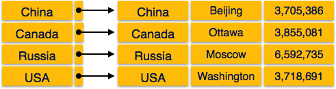
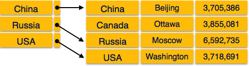

**Credits: contents presented here have been taken from [online javatpoint DBMS tutorial](https://www.javatpoint.com/dbms-three-schema-architecture)**

# What is Indexing

We know that data is stored in the form of records. Every record has a key field, which helps it to be recognized uniquely.
**Indexing is a data structure technique** to efficiently retrieve records from the database files based on some attributes on which the indexing has been done. Indexing in database systems is similar to what we see in books.

Indexing is defined based on its indexing attributes. Indexing can be of the following types −

**Primary Index:**  Primary index is defined on an ordered data file. The data file is ordered on a **key field**. The key field is generally the primary key of the relation.

**Secondary Index:**  Secondary index may be generated from a field which is a candidate key and has a unique value in every record, or a non-key with duplicate values.

**Clustering Index:**  Clustering index is defined on an ordered data file. The data file is ordered on a non-key field.

Ordered Indexing is of two types

**Dense Index**
**Sparse Index**

## Dense Index

In dense index, there is an index record for every search key value in the database. This makes searching faster but requires more space to store index records itself. Index records contain search key value and a pointer to the actual record on the disk.

## Sparse Index

In sparse index, index records are not created for every search key. An index record here contains a search key and an actual pointer to the data on the disk. To search a record, we first proceed by index record and reach at the actual location of the data. If the data we are looking for is not where we directly reach by following the index, then the system starts sequential search until the desired data is found.

## Multilevel Index

Index records comprise search-key values and data pointers. Multilevel index is stored on the disk along with the actual database files. As the size of the database grows, so does the size of the indices. There is an immense need to keep the index records in the main memory so as to speed up the search operations. If single-level index is used, then a large size index cannot be kept in memory which leads to multiple disk accesses.

Multi-level Index helps in breaking down the index into several smaller indices in order to make the outermost level so small that it can be saved in a single disk block, which can easily be accommodated anywhere in the main memory.

## B+ Tree

A B+ tree is a balanced binary search tree that follows a multi-level index format. The leaf nodes of a B+ tree denote actual data pointers. B+ tree ensures that all leaf nodes remain at the same height, thus balanced. Additionally, the leaf nodes are linked using a link list; therefore, a B+ tree can support random access as well as sequential access.

**Structure of B+ Tree)**

Every leaf node is at equal distance from the root node. A B+ tree is of the order n where n is fixed for every B+ tree.

## Internal nodes −

Internal (non-leaf) nodes contain at least ⌈n/2⌉ pointers, except the root node.
At most, an internal node can contain n pointers.

## Leaf nodes −

Leaf nodes contain at least ⌈n/2⌉ record pointers and ⌈n/2⌉ key values.
At most, a leaf node can contain n record pointers and n key values.
Every leaf node contains one block pointer P to point to next leaf node and forms a linked list.

### B+ Tree Insertion

- B+ trees are filled from bottom and each entry is done at the leaf node.

- If a leaf node overflows −

 + Split node into two parts.

 + Partition at i = ⌊(m+1)/2⌋.

 + First i entries are stored in one node.

 + Rest of the entries (i+1 onwards) are moved to a new node.

 + ith key is duplicated at the parent of the leaf.

_ If a non-leaf node overflows −

 + Split node into two parts.

 + Partition the node at i = ⌈(m+1)/2⌉.

 + Entries up to i are kept in one node.

 + Rest of the entries are moved to a new node.

## B^+^ Tree Deletion

_ B^+^ tree entries are deleted at the leaf nodes.

_ The target entry is searched and deleted.

+ If it is an internal node, delete and replace with the entry from the left position.

_ After deletion, underflow is tested,

+ If underflow occurs, distribute the entries from the nodes left to it.

_If distribution is not possible from left, then 

+ Distribute from the nodes right to it.

_ If distribution is not possible from left or from right, then

+ Merge the node with left and right to it.
